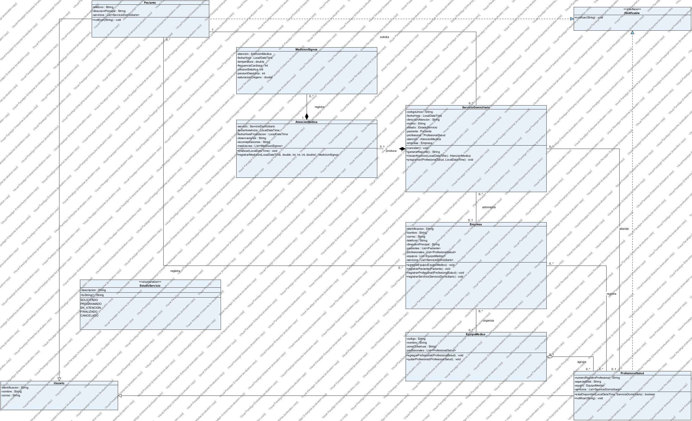

# Medihome — Taller de diseño de software

nombres de los integrantes del trabajo: Alvaro Samuel Vallejo Rodriguez, Johan Steven Muñoz Enriquez

Programa en Java para representar el servicio médico domiciliario de Medihome. El proyecto parte del diagrama realizado en clase y completa las clases y relaciones del enunciado.

## Archivos de la entrega

| Archivo o carpeta | Contenido |
| --- | --- |
| `src/` | Clases Java y clase `Main`. |
| `diagramas/diagrama-de-clases.vpp` | Proyecto editable de Visual Paradigm con la vista de relaciones y la vista detallada de clases y métodos. |
| `diagramas/diagrama-de-clases.png` | Imagen del modelo con sus relaciones, atributos y operaciones principales. |
| `diagramas/diagrama-detallado.png` | Imagen detallada con constructores, getters, setters y los demás métodos implementados. |
| `diagramas/referencia/` | Archivo `.vpp` original de clase y su imagen, conservados como referencia. |
| `docs/reporte-ejemplo.txt` | Salida de una ejecución de `Main`. |
| `tests/PruebasMedihome.java` | Pruebas de las reglas y relaciones del modelo. |
| `ejecutar.bat` | Compila y ejecuta el ejemplo en Windows. |

## Clases implementadas

| Clase | Responsabilidad |
| --- | --- |
| `Empresa` | Guarda identificación, nombre, correo, teléfono y dirección principal; registra pacientes, profesionales, equipos y servicios. |
| `Usuario` | Clase abstracta con identificación, nombre y correo, compartidos por pacientes y profesionales. |
| `INotificable` | Interfaz que declara `notificar(String mensaje)`. |
| `Paciente` | Hereda de `Usuario`, implementa `INotificable` y tiene teléfono, dirección principal y servicios solicitados. |
| `ProfesionalSalud` | Hereda de `Usuario`, implementa `INotificable` y tiene registro profesional, especialidad, equipo y servicios asignados. |
| `EquipoMedico` | Tiene código, nombre, zona de cobertura y profesionales; permite agregar y quitar integrantes. |
| `ServicioDomiciliario` | Tiene código único, fecha y hora programadas, dirección, motivo y estado; corresponde a un paciente y permite asignar un profesional. |
| `EstadoServicio` | Enumeración con `SOLICITADO`, `PROGRAMADO`, `EN_ATENCION`, `FINALIZADO` y `CANCELADO`. |
| `AtencionMedica` | Tiene inicio, finalización, observaciones y recomendaciones; pertenece a un servicio y registra mediciones. |
| `MedicionSignos` | Guarda fecha y hora, temperatura, frecuencia cardíaca, presión sistólica y diastólica y saturación de oxígeno; pertenece a una atención. |
| `Main` | Instancia los objetos y muestra el reporte solicitado en la actividad. |
| `Validacion` | Clase auxiliar con validaciones de texto y valores numéricos. |

## Relaciones y decisiones de diseño

- **Herencia:** `Paciente` y `ProfesionalSalud` extienden `Usuario`. Los getters y setters de identificación, nombre y correo se heredan.
- **Interfaz:** pacientes y profesionales implementan `INotificable` y reciben avisos cuando cambia el estado de su servicio.
- **Asociación:** cada servicio corresponde a **un paciente**. Un paciente puede tener **cero o varios servicios**. Un servicio solicitado todavía puede no tener profesional; al programarlo se asigna **uno**.
- **Agregación:** un equipo agrupa profesionales. Cambiar o abandonar un equipo conserva al profesional en el sistema y actualiza ambos lados de la relación.
- **Composición:** un servicio produce **cero o una atención**; cada atención corresponde a **un servicio**. Una atención contiene **cero o varias mediciones**; cada medición corresponde a **una atención**.
- La atención se crea mediante `servicio.iniciarAtencion(...)`, y la medición mediante `atencion.registrarMedicion(...)`. Esos métodos devuelven los objetos que utiliza `Main` y mantienen sus propietarios.
- Los atributos modificables tienen getters y setters. Las listas se consultan con getters y se modifican mediante métodos de registro; se devuelven como listas no modificables. El paciente del servicio y los propietarios de la atención y de la medición se establecen al construirlos y no se reasignan.
- `setEstado(...)` valida las transiciones. No permite finalizar un servicio sin una atención terminada. Un servicio solicitado o programado puede cancelarse.
- La empresa verifica que no se repitan códigos de servicios. La programación rechaza dos servicios del mismo profesional en la misma fecha y hora. El ejemplo no gestiona intervalos de duración previstos.
- Las mediciones deben estar dentro del intervalo de la atención. Se validan valores positivos y finitos y una saturación de oxígeno de hasta 100 %.

Del diagrama original se conservaron los nombres `EquipoMedico` y `MedicionSignos`. Se corrigieron las asociaciones usadas como herencia y las multiplicidades invertidas, y se añadieron la empresa, la especialidad y la enumeración de estados. La vista detallada incluye los métodos del código Java; la vista de relaciones oculta los getters y setters para facilitar la lectura.

## Diagrama de clases

[Ver diagrama detallado con getters y setters](diagramas/diagrama-detallado.png)

Las imágenes exportadas conservan la marca de agua de la licencia de evaluación de Visual Paradigm utilizada.

Para editarlo, abrir `diagramas/diagrama-de-clases.vpp` en Visual Paradigm.
